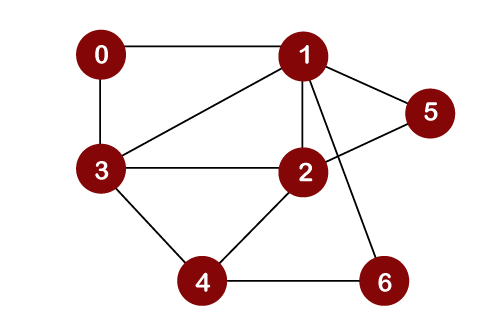
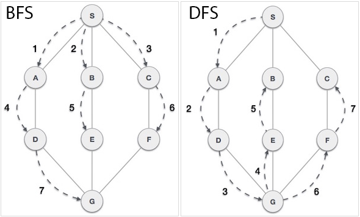
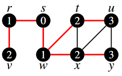
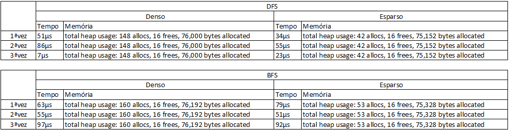

**Estruturas de Representação e Caminhamento em Grafos**
=

## **Problema**
Este trabalho contém uma divisão de três problemas propostos:
    
1. Construir um grafo utilizando uma estrutura representativa por matriz de adjacência e executar os métodos de BFS e DFS juntamente;
2. Construir um grafo utilizando uma estrutura representativa por matriz de incidência e executar os métodos de BFS e DFS juntamente;
3. Elaborar um problema básico real que consiga ser solucionado por minha implementação;
4. Apresentação do consumo de tempo e memória Ram para as diferentes estruturas;

## **Instruções e referências para o uso do código**
O algoritmo atual deste repositório foi construído utilizando a linguagem C++, através do sistema operacional Windows 11 operando em ambiente Linux (WSL2 - Ubuntu-20.04). A compilação pode ser feita por meio do comando "make" e executado com "make run". O *"output"* e objetos (*-o) podem ser removidos com "make clean" em caso de algum erro imprevisto com compilações passadas ou transição entre sistemas operacionais.

* Atalho
    - Copie e cole a seguinte linha de comando: **make clean; make; make run**

## **Grafo, BFS e DFS**
Grafo: estrutura composta por um conjunto de vértices podendo ou não ter ligações entre eles, essas ligações são chamadas de aresta. [[Para saber mais]](https://www.ime.usp.br/~pf/algoritmos_em_grafos/aulas/grafos.html)

    </img>
    
 
    <figcaption>Fig. Representação de um grafo</figcaption>
    

BFS e DFS: O *Breadth First Search* ou em português, busca em largura bem como o *Depth First Search* (busca em profundidade) são métodos utilizados para se fazer uma varredura completa de um grafo partindo de um ponto *x* e percorrendo todos os demais vértices que compõem a estrutura. Porém apesar de seu propósito semelhante, eles apresentam algumas diferenças que podem ser contrastadas a seguir:
* BFS: este algoritmo seleciona um único nó (ponto inicial ou de origem) em um grafo e então visita todos os nós adjacentes ao nó selecionado. Depois que o algoritmo visita e marca o nó inicial, ele se move em direção aos nós não visitados mais próximos e os analisa. Uma vez visitados, todos os nós são marcados. Essas iterações continuam até que todos os nós do grafo tenham sido visitados e marcados com sucesso. A forma completa do BFS é a busca em largura.
* DFS: este é um algoritmo para encontrar ou percorrer grafos ou árvores na direção da profundidade. A execução do algoritmo começa no nó raiz e explora cada ramo antes de retroceder. Ele usa uma estrutura de dados de pilha (no caso deste projeto, a recursão) para lembrar, obter o vértice subsequente e iniciar uma pesquisa, sempre que um beco sem saída aparecer em qualquer iteração. A forma completa de DFS é a pesquisa em profundidade.

    </img>
    
 
    <figcaption> Fig. Representação da sequência da BFS e DFS em um grafo</figcaption>
    

## **Funcionamento**
Ao executar o programa temos como primeiro *output* um menu que conta com as seguintes opções:

    1 - PROBLEMA AULA (LISTA  DE ADJACÊNCIA)
    2 - PROBLEMA AULA (MATRIZ DE ADJACÊNCIA)
    3 - PROBLEMA AULA (MATRIZ DE INCIDÊNCIA)
    4 - PROBLEMA PRINCIPAL (MAPEAMENTO COM GRAFO)
    5 - GRAFO DENSO   (144 VÉRTICES) - TEMPO x MEMÓRIA
    6 - GRAFO ESPARSO (144 VÉRTICES) - TEMPO x MEMÓRIA
    0 - SAIR
    
### **Obs.:** Dentre os problemas indicados no começo desse relatório, eles podem ser relacionados no programa como às seguintes opções:
- **Opção 2: Problema 1**
- **Opção 3: Problema 2**
- **Opção 4: Problema 3**
- **Opção 5: Problema 4**
- **Opção 6: Problema 4**

Para cada uma dentre essas três opções conectaremos o grafo utilizando uma lista ou matriz, dependendo da descrição da opção.

    Para o melhor entendimento sobre a representação de cada estrutura,
    visualize os exemplos abaixo usando um grafo qualquer com 3 vértices:
        
         Grafo               Orientação:
           2             1 liga à 2 (aresta A)
       A /   \           2 liga à 3 (aresta B)
        /     \ B        3 liga à 1 (aresta C)
       1 ----- 3
           C
    
    Representação por uma lista de adjacência:
        1->2      // pode ser lido como (1 liga à 2)
        2->3      // pode ser lido como (2 liga à 3)
        3->1      // pode ser lido como (3 liga à 1)

    Representação por uma matriz de adjacência:
        1  2  3
    1 | 0  1  0   // pode ser lido como (1 liga à 2)
    2 | 0  0  1   // pode ser lido como (2 liga à 3)
    3 | 1  0  0   // pode ser lido como (3 liga à 1)
    
    Represetações por incidência são estruturas diferentes das
    adjacentes pois elas são criadas observando a ligação feita por
    cada aresta. Sendo assim, com o mesmo grafo, faremos a representação
    por uma matriz de incidência.

    Representação por uma matriz de incidência:
        A   B   C         Pode ser entendida como:
    1   1   0  -1      // 1 parte para 2 & 1 recebe 3
    2  -1   1   0      // 2 parte para 3 & 2 recebe 1
    3   1  -1   0      // 3 parte para 1 & 3 recebe 2

Para as opções **1(*um*)**, **2(*dois*)** e **3(*três*)** o grafo utilizado como referência pode ser visto abaixo:

    </img>
    
 
    <figcaption> Fig. Grafo retirado da aula 11 - Slide 09</figcaption>
    

Sendo assim, o grafo será inteiramente conectado de acordo com os parâmetros passados às listas e/ou matrizes e em seguida terão os métodos de BFS e DFS executados e exibidos.

As opções 5 e 6 servem para calcular a diferença de tempo entre as estruturas BFS e DFS em grafos densos e esparsos, respectivamente. Essa opção será usada apenas para comparar e descrever o tempo que cada busca leva para percorrer o grafo por completo.

Já na opção **4(*quatro*)** é montado um grafo através de uma lista de adjacência utilizando como referência o mapa descrito na explicação desse problema em específico (visualizar abaixo "Problema Mapeamento e Resolução (Problema 3)"). Com as conexões feitas é executado o método BFS para fazer a varredura de todos os vértices (esquinas). Por fim, com todos os vértices conhecidos, conseguiremos descobrir se é possível realizar o percurso e, se sim, qual o melhor caminho a ser traçado de um ponto a outro.

Ao fim da execução de cada opção, o destrutor da classe grafo é chamado e toda a estrutura criada é removida. Isso é feito para tentar otimizar o consumo de memória do nosso sistema.

## **Alterações**

### Matrizes de Adjacência e Incidência
Para a matriz de adjacência, existe uma solução simples fazendo o uso de uma matriz linha(*i*) x coluna(*j*) que tem cada uma de suas posições verificadas. Isso é feito de forma que as informações da matriz são passadas para o método de inserção por lista de adjacência. Sendo assim, é feito o caminho linha a linha de 0x0 à *i*x*j* e uma conexão é feita sempre que encontramos o valor 1. Para efetuar a ligação, passamos para a função *insertEdge* o index da linha (vértice atual) e o valor do index da coluna (vértice que será conectado ao vértice atual).

Para a matriz de incidência, não consegui achar uma solução para representá-la.

### DFS e BFS
Ambas as estruturas mantêm a mesma lógica aplicada pelo professor em aula, portanto não foram feitas mudanças em quesito execução delas. Porém, é necessário ressaltar que pelo motivo da necessidade do uso da função BFS para a resolução do problema elaborado, houveram mudanças em sua chamada bem como a adição de elementos optativos a serem executados após a visita de todos os vértices. Portanto, agora, é necessário que passemos dois parâmetros à BFS, que são divididos em vértice de origem e vértice de destino de forma que possamos descobrir o caminho mínimo de um ponto a outro, dentre os dois informados. Caso o caminho mínimo não seja importante de se saber, basta informar o ponto de partida e destino como 0, pois assim, o caminho mínimo não será calculado. A mudança feita ao final da função é com base na busca do menor caminho e ela pode ser vista de forma mais descritiva na discussão do tópico "*Problema Mapeamento e Resolução (Problema 3)*", especificamente na resolução.

## **Memória Ram e Tempo de Execução**
Para medir o consumo de memória Ram de cada umas das opções de execução do menu, não foi possível a utilização do comando *memusage -T ./app.cpp*. Desse modo a medição foi feita por meio do programa Valgrind (*sudo apt install valgrind* em Linux), utilizando o comando de compilação do código (*make*) seguido por *valgrind build/app*. O programa então é executado e nele serão mostradas diversas informações sobre declarações de variáveis, chamadas de método, etc. Dentre essas informações está o consumo de memória, que é mostrado ao finalizar o nosso programa. Já a medição de tempo foi feita utilizando a biblioteca *chrono*, isso feito diretamente do código, e o tempo é cronometrado a cada chamada da função BFS e DFS nas opções 5 e 6 do menu.

Dessa forma, essas foram as duas ferramentas utilizadas para medir memória e tempo. Além disso, foi feita também, como garantia, a observação do uso de memória por meio do monitor de recursos que pode ser acessado através do comando *htop*, também via terminal Linux.

As informações sobre tempo e memória podem ser vistas na tabela abaixo:

    </img>
    
 
    <figcaption> Fig. Tempo e Memória (Grafo Denso e Esparso utilizando BFS e DFS)</figcaption>
    

**Obs.:** cada teste foi realizado 3 vezes de forma individual, ou seja, Grafo Denso(BFS), Grafo Esparso(BFS), Grafo Denso(DFS), Grafo Esparso(DFS). O consumo de memória sempre gerou o mesmo resultado durante os 3 testes, alterando apenas caso mudássemos a estrutura.

**Resultados:** 
- Tempo médio (microsegundos):
    - Grafo Denso(DFS): 48µs
    - Grafo Esparso(DFS): 37.3µs
    - Grafo Denso(BFS): 71.6µs
    - Grafo Esparso(BFS): 74µs
- Uso de memória (bytes):
    - Grafo Denso(DFS): 76.000
    - Grafo Esparso(DFS): 75.152
    - Grafo Denso(BFS): 76.192
    - Grafo Esparso(BFS): 75.328

## **Problema Mapeamento e Resolução** (Problema 3)
### Problema:
O tema escolhido para esse problema, é feito para auxiliar na forma de se deslocar partindo de um ponto de origem ao ponto de destino em uma mapa da cidade. Analisando a situação e nunca tendo procurado saber qual o melhor caminho para se chegar até lá, resolvi fazer desse trabalho uma resposta a minha pergunta juntamente com a demonstração desse interessante assunto, que é o mapeamento de uma região qualquer por meio de um grafo, bem como o deslocamento através dele. Sendo assim, o mapa de uma determinada região foi usado para a montagem de um grafo no qual os seu vértices são representado pelas esquinas do mapa suas arestas as ruas que ligam uma esquina a outra. A proposta é partir do vértice 6 (origem) e chegar ao vértice 20 (destino) percorrendo o caminho com o menor número de esquinas, ou ajustes da rota. Percorrer o caminho com menor número de esquinas não quer dizer que o caminho seja menor, para que a distância das ruas fossem consideradas, outros tipos de algoritmos seriam mais úteis, como é o caso do Algoritmo de Djikstra, utilizado pela plataforma google maps para traçar rotas. Ver imagem do mapa abaixo:

    </img>
    
 
    <figcaption> Fig. Output esperado: 6, 12, 13, 14, 15, 16, 20</figcaption>
    

#### **Obs.:** para a criação desse grafo, as arestas e vértices não são ponderadas e, portanto, meu problema busca apenas a passagem pelo menor número de vértices para se chegar ao ponto de interesse.

### Resolução:
Utilizando a estrutura BFS e conhecendo todas as conexões entre as ruas do meu mapa, bastava achar o melhor caminho partindo agora do ponto de interesse (vértice 20) e deslocá-lo nível a nível até encontrar o ponto de saída com nível 0. Esses níveis podem ser entendidos como a distância do ponto atual em relação a origem, ou seja, o vértice de destino (20) está a 6 níveis de distância partindo do vértice de origem (6) até seu encontro. Os níveis são estruturas utilizadas pela BFS para se orientar durante sua exploração, além disso existe uma estrutura que armazena os vértices antecessores ao nó verificado e ela guarda todo o caminho feito durante suas descobertas.

Resumidamente: partimos da posição de interesse (20 - nível 6) e vamos em direção a posição inicial (6 - nível 0). Pega-se cada antecessor do vértice que tenha como nível 1a unidade abaixo do nível do vértice atual e o armazena em alguma estrutura. Agora, vá em direção ao próximo. Esses passos deverão ser feitos até que se chegue ao vértice que não possui antecessor, no caso, a origem. Fazendo isso, ao final teremos o caminho, de trás para frente, da melhor solução para o deslocamento. Basta agora que inverta o caminho armazenado na estrutura para melhor visualizá-lo.

Para demonstrar, o que foi feito aqui está o algoritmo pensado:

    end = 20
    
    // verifica se existe alguma solução possível
    if (color[end] == 0) // vértice não foi alcançado e portanto solução impossível
        return;
    
    int curr = end;
    while (curr != -1) {          // se bater em -1 chegou a origem -> 6
        q.inqueue(curr);          // registra o caminho na fila
        curr = predecessor[curr]; // próximo nível/pai
    }

    q.reverse();
    q.print();

## **Referências**
https://www.ime.usp.br/~pf/algoritmos_em_grafos/aulas/grafos.html

https://www.tutorialspoint.com/difference-between-bfs-and-dfs

https://www.guru99.com/difference-between-bfs-and-dfs.html